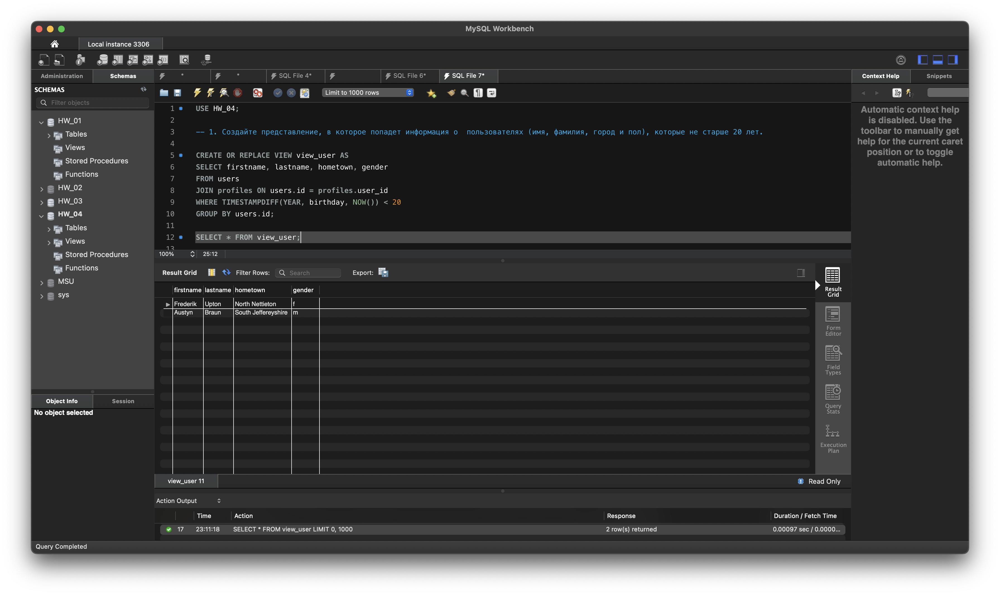
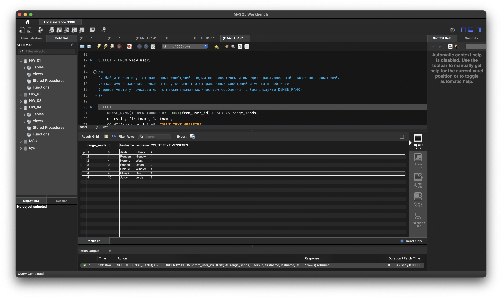
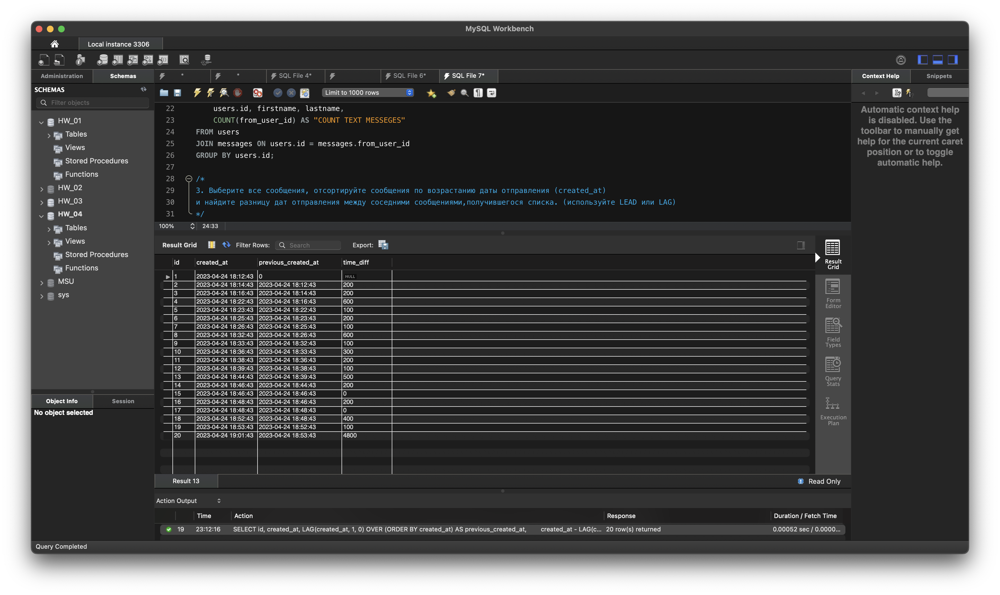

USE HW_04; 

-- 1. Создайте представление, в которое попадет информация о  пользователях (имя, фамилия, город и пол), которые не старше 20 лет. 

CREATE OR REPLACE VIEW view_user AS  
SELECT firstname, lastname, hometown, gender 
FROM users 
JOIN profiles ON users.id = profiles.user_id 
WHERE TIMESTAMPDIFF(YEAR, birthday, NOW()) < 20 
GROUP BY users.id; 

SELECT * FROM view_user; 

/*
2. Найдите кол-во,  отправленных сообщений каждым пользователем и выведите ранжированный список пользователей,
указав имя и фамилию пользователя, количество отправленных сообщений и место в рейтинге 
(первое место у пользователя с максимальным количеством сообщений) . (используйте DENSE_RANK)
*/

SELECT 
	DENSE_RANK() OVER (ORDER BY COUNT(from_user_id) DESC) AS range_sends, 
	users.id, firstname, lastname, 
	COUNT(from_user_id) AS "COUNT TEXT MESSEGES" 
FROM users 
JOIN messages ON users.id = messages.from_user_id 
GROUP BY users.id; 

/*
3. Выберите все сообщения, отсортируйте сообщения по возрастанию даты отправления (created_at) 
и найдите разницу дат отправления между соседними сообщениями,получившегося списка. (используйте LEAD или LAG)
*/

SELECT id, created_at, LAG(created_at, 1, 0) OVER (ORDER BY created_at) AS previous_created_at, 
       created_at - LAG(created_at) OVER (ORDER BY created_at) AS time_diff 
FROM messages 
ORDER BY created_at ASC; 
